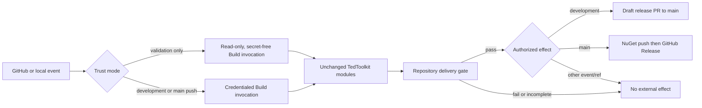

# Repository delivery architecture

- Status: Active
- Owner: repository maintainers
- Scope and system boundary: CI/CD for the Pipeline and StateMachine products from repository event intake through test/package verification and optional GitHub/NuGet effects; this record governs the boundary while the pinned TedToolkit module contracts remain compatible.
- Applicable product intent: None
- Governing principles: None
- Related ADRs: None
- Approval source: the user approved the event/branch/effect matrix and required no TedToolkit code changes in the Codex task on 2026-09-06.

## Current architecture

The repository Build project is the single product-delivery control plane. It consumes the pinned `externals/TedToolkit` submodule and composes its existing modules; GitHub Actions is only the trust boundary that selects validation or delivery, grants credentials, invokes the Build project, and retains outputs. Product build, test, packaging, pull-request, publishing, and release actions are not reimplemented in workflow YAML or repository scripts.

The repository owns one compatibility boundary: a delivery gate between TedToolkit's test/package production and every module capable of an external effect. This gate exists because the pinned TedToolkit release base depends on compile stages but does not itself guarantee that `TestModule` and repository-specific package verification complete first. The gate may interpret TedToolkit-produced test reports and repository package contracts, but it does not reproduce the underlying CI/CD actions.

The authorized matrix is:

| Event and ref | Trust and credentials | External effect after the gate |
| --- | --- | --- |
| Pull request, feature-branch push, or manual dispatch | Validation-only; `contents: read`; no other write permission, AI credential, or publishing credential | None |
| Push to `development` | `contents: read` and `pull-requests: write`; no other write permission, AI credential, or NuGet publishing credential | Create or retain the draft release pull request to `main` only |
| Push to `main` | `contents: write` plus NuGet publishing configuration; no other write permission or AI credential | Push NuGet packages, then create the GitHub Release; no pull-request mutation |

Unlisted event/ref combinations are validation-only, and unlisted GitHub write permissions are absent. No mode receives AI credentials, which keeps AI-dependent modules ineligible. Delivery for the same ref is serialized. Every external effect uses the unchanged TedToolkit implementation and branch conditions; the repository gate adds ordering and product-specific verification, not alternative release behavior.

## Constraints for change design

- Do not edit files under `externals/TedToolkit` or advance the pinned submodule revision merely to customize this repository's delivery.
- A delivery change must keep GitHub write permissions and publishing secrets absent from validation-only execution, grant only the exact matrix scopes to delivery jobs, and provide no AI credentials in any mode.
- Failed builds, failed or missing reports from any configured suite, invalid package contents, or failed bounded consumer verification must prevent every external-effect module from starting.
- Pipeline and StateMachine remain equal delivery products: both test suites and both matching runtime/analyzer packages are required.
- Workflow YAML may express event/ref selection, least privilege, concurrency, environment mapping, invocation, and artifact retention; product build/test/pack/release commands belong to the Build project and TedToolkit modules.
- Local verification must be incapable of NuGet publication, pull-request mutation, or GitHub Release creation.

## Decision links and exceptions

No ADR or principle exception is required. The architecture chooses a repository-side compatibility gate because changing shared TedToolkit code is outside this repository's delivery boundary and duplicating the shared CI/CD actions would create a second authority.

## Review triggers

Reassess this record when the pinned TedToolkit revision changes its module dependencies, GitHub-only detection, branch names, versioning, credential requirements, or external effects; when another CI provider is introduced; when package publication requires provenance/signing/approval environments; when Pipeline and StateMachine no longer share a release boundary; or when any workflow path can bypass the repository gate.
