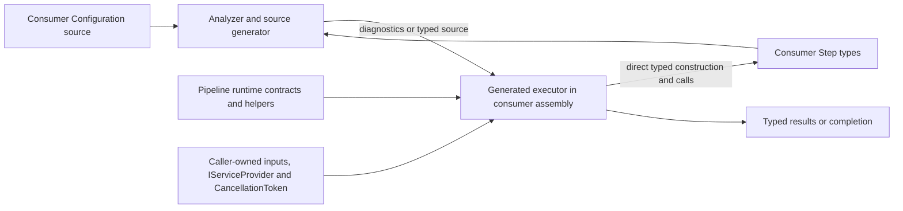

# Pipeline compile-time and execution architecture

- Status: Active
- Owner: library maintainers
- Scope and system boundary: the packaged Pipeline runtime, bundled analyzer/source generator, generated executor in the consumer compilation, consumer-defined Steps, and caller-owned execution resources; this record governs the current static in-process model until a review trigger fires.
- Applicable product intent: `docs/product/README.md@ca17f5c3a11b3d6e132983b9eb74b91b51625668`
- Governing principles: `docs/principles/README.md@3721d7b57f37dcbdc4a527be9ec235182d36a884`
- Related ADRs: None
- Approval source: explicitly approved by the user in the originating Codex task on 2026-09-05.

## Current architecture

The package has one compile-time control plane and one generated runtime data plane. The analyzer is build tooling, not a runtime graph engine. The runtime assembly exposes marker contracts and shared attempt/cancellation helpers but does not retain graph state.

Dependency direction is one-way:

1. Consumer source declares a statically visible graph using the runtime's empty Builder, StepBuilder and StepArgument markers.
2. The analyzer binds the actual Pipeline and Step symbols, validates the supported declaration subset, reads node identity and bindings, and either reports diagnostics or creates an execution plan.
3. The generator emits the graph-specific constructor, typed inputs, typed Results, per-node methods and execution entry points into the consumer assembly.
4. Generated code depends on the runtime's Step contracts and shared policy helpers, on `Microsoft.Extensions.DependencyInjection.Abstractions` for service resolution, and on consumer Step types. The runtime never depends on analyzer implementation and never interprets the graph.

The NuGet package couples these planes deliberately: the .NET 10 runtime project bundles the netstandard2.0 analyzer and its private analyzer dependencies under `analyzers/dotnet/cs`. Package consumers compile with the matching generator and must recompile when it changes. Direct project-reference consumers reproduce the analyzer reference and dependency import explicitly.

### Compile-time flow

Configuration is declaration-only and is never called by generated execution. Registrations are read in source order. A node registration creates identity; an alias preserves identity. Omitted arguments become execution inputs, previous result-bearing nodes become typed dependencies, fixed expressions are mirrored into the consuming node, and `[FromServices]` parameters remain runtime service lookups. Exact type and nullability matching, supported Step lifetime, graph shape, policy values and generated names are compile-time concerns.

Unsupported syntax does not fall back to runtime behavior. The generator emits no executor for an invalid graph, while the bundled analyzer reports misuse of configuration APIs, invalid Step contracts and direct calls that bypass declared policies.

### Runtime flow

The caller creates a generated executor with an `IServiceProvider` and invokes a generated entry point with typed inputs and a cancellation token. Arguments and services are evaluated or resolved when their Step becomes ready and are reused across that Step's retries. Every attempt constructs a fresh ref-struct Step.

All-synchronous graphs execute synchronously. Linear asynchronous graphs use direct Task calls and awaits. When independent asynchronous work exists, the entry point starts typed node tasks in registration order; each node awaits only its own upstream tasks, and an outer non-generic `Task.WhenAll` drains all started work. The generated executor uses a linked token source for the invocation, cancels remaining work after a terminal node failure, and preserves cooperative rather than forced cancellation.

`StepAttempt` owns retry budget and per-attempt timeout resources. Argument evaluation, dependency completion and service resolution happen outside the retry loop. Synchronous disposal completes before success or retry; asynchronous lifetime and cleanup belong to the returned Task. The caller retains ownership of the service provider and its scope.

Collecting typed Results is explicit. Completion-only entry points execute the same graph without constructing a result snapshot. Generated flow remains directly inspectable and contains no runtime graph collection, reflection activation, interface-based Step dispatch, `Task.Run`, detached background work or pipeline-owned service scope.

## Constraints for change design

- Preserve the static, in-process product boundary. Dynamic graphs, persisted workflows, distributed scheduling, streaming backpressure or stateful reusable Steps require product-intent and architecture review before delivery design.
- Treat the runtime contracts, generated public entry points/results, diagnostic behavior and analyzer packaging as one consumer contract. A change must state source and binary compatibility, whether consumer recompilation is required, and how analyzer/runtime version skew is prevented.
- Preserve symbol-identity binding, exact type/nullability checks, node identity, registration and argument evaluation order, per-Step retry reuse, and the distinction between completion-only and result-collecting execution.
- Preserve explicit lifetime ownership: caller-owned DI scope, fresh Step per attempt, synchronous cleanup before retry, async cleanup inside the returned operation, cooperative cancellation, and draining of all started parallel work.
- Performance changes must compare equivalent semantics and separate construction, synchronous, synchronously completed async, suspended async, parallel, policy and result-collection costs. Allocation or timing claims require source-bound evidence.
- Generated execution must remain trimmable when consumer code does not root Configuration. Reflection or new runtime discovery requires an explicit trimming analysis.
- The analyzer must remain usable by the compiler target it declares, and analyzer dependencies must remain private build-time assets rather than runtime package dependencies.

## Decision links and exceptions

[`named-executors.md`](named-executors.md) defines the accepted declaration-only executor direction and its detailed execution semantics. This record describes how that decision partitions responsibilities across the packaged system.

Active principles P6 and P7 in [`../principles/README.md`](../principles/README.md) govern compile-time rejection and runtime ownership. No ADR exception is currently recorded.

## Review triggers

Reassess this architecture when any of the following becomes necessary:

- graphs assembled or mutated at runtime;
- persisted, distributed, streaming or invocation-surviving execution;
- framework-owned service scopes, Step instances, async cleanup or detached tasks;
- runtime interpretation, reflection activation, interface-based Step dispatch or an untyped result store;
- analyzer and runtime packages versioned or distributed independently;
- a target framework change that alters compiler, ref-struct, trimming, Task or DI constraints;
- public generated API or diagnostic compatibility that cannot be handled by consumer recompilation;
- measured workloads showing that the current typed task topology cannot meet an approved performance objective.
