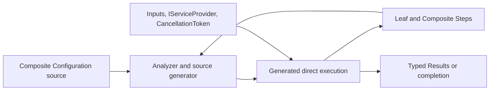

# Pipeline compile-time and execution architecture

- Status: Active
- Owner: library maintainers
- Governing decisions: [ADR-0001](../adr/ADR-0001-generated-step-context.md) and [ADR-0002](../adr/ADR-0002-unified-composite-step.md)

## Boundary

Pipeline has one compile-time control plane and one generated runtime data plane. The analyzer/source generator reads consumer `StepGraph` declarations and emits only graph-specific typed code into the consumer assembly. The runtime package exposes contracts and graph-independent execution support; it never stores or interprets a graph. Generated code reaches that support through the public, IntelliSense-hidden `CompilerServices.PipelineExecutionSupport` contract.

## Compile-time model

- A leaf is an `internal readonly ref partial struct` implementing exactly one synchronous or asynchronous Step interface.
- A Composite is an attributed `public` or `internal readonly ref partial struct` with exactly `private void Configuration(StepGraph)`.
- Composite primary-constructor parameters are data inputs; DI belongs only to leaf constructor parameters marked `[FromServices]`.
- Generated factory extensions return empty-state `StepBuilder` handles. They exist only to describe typed data edges, `DependsOn` edges, retry, timeout, and display name.
- Every Step receives generated required `DisplayName`; `[StepLogger]` additionally receives generated required `ILogger`.
- Invalid or dynamic declarations produce diagnostics and no executable fallback.

The removed class-based `Pipeline`, `Pipeline.Builder`, `[StepPolicy]`, and `StepMetadata` contracts have no compatibility layer.

## Runtime model

The generated nested `Composite.Pipeline` is a thin reusable root facade. It is parameterless when the transitive graph is service-free and otherwise stores a caller-owned `IServiceProvider`. Service-free Composite forwarders and static cores omit the provider parameter entirely; no empty-provider substitute is created. The facade creates no scope and owns no service lifetime.

Node execution follows dependency readiness. Fixed expressions and services are evaluated once before that node's retry loop. Each attempt constructs a fresh ref struct with object-initialized generated context. A finite timeout is cooperative through a linked token. Caller cancellation is never retried. Synchronous disposal completes before retry or return.

A nested Composite is invoked directly as a typed Step with the same provider. Its facade is not constructed. Its `Results` value is the parent node's typed result. A retry on the parent registration reruns the whole nested graph and may repeat completed child side effects.

All-synchronous graphs remain synchronous. Asynchronous graphs keep typed node Tasks and drain all started work. Generated ref-struct instance methods are non-async forwarders into static cores, so neither leaf nor Composite instances are captured or boxed.

## Quality attributes

- Static safety: exact symbol and nullability binding; no reflection or untyped result store.
- Allocation transparency: no runtime graph and no nested facade allocation; async Composite boundaries may add Task/state-machine state.
- DI ownership: the caller chooses and disposes the provider/scope.
- Trimming: Configuration is source-only and can be removed when not otherwise rooted.
- Packaging: runtime and matching analyzer ship together and consumers recompile on upgrade.

## Verification

The Pipeline tests cover all Step contracts, node policies, control dependencies, input timing, DI, logging, disposal, cancellation, concurrency, root/nested Composite execution, public cross-compilation, generated context, and diagnostics. Playground publishing verifies trimming. Benchmarks compare direct, flat Composite, and one-boundary nested Composite paths with facade construction outside measured invocations.

See [Composite Step declarations](named-executors.md) for the authoring contract and [the accepted change](../changes/configure-pipeline-nodes/change.md) for acceptance boundaries.
